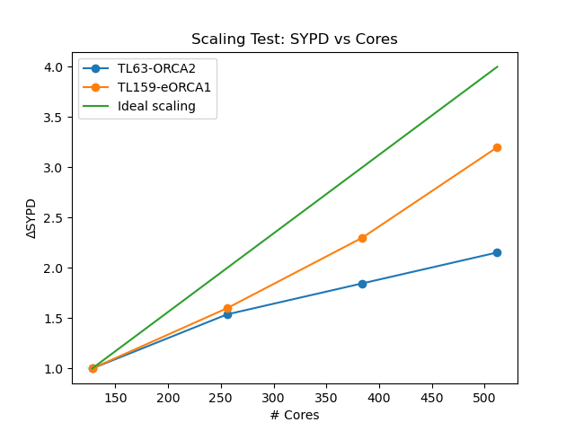

```
    _       _         _
   | |     | |  ___ _| |_  ___  _
   | | ___ | |_/ __|_   _|/ _ \| |__
   | |/ _ \| _ \__ \ | |_|  __/|  _/        
   |_|\___/|___/___/ |____\___\|_|          
_______________________________________
LOad Balancing ScripT for Ec-earth fouR
```

## Overview

"LOad Balancing ScripT for Ec-earth fouR" (LOBSTER) is a suite for the evaluation of simulation performance in EC-Earth4.

## Documentation

Files needed:

- [ ]  `NODE.001_01`
- [ ]  `leginfo.yml`
- [ ]  `timing.log`
- [ ]  `paths.yml` (optional)

## Examples

Loaded libraries:

``` 
import numpy as np
import matplotlib.pyplot as plt
import lobster as lobs
```

Available commands:

- [x] single plot: `lobs.plot_sypd_vs_time(expname, leg)`
- [x] multi plots:  `lobs.multiplot_vs_time(expname, leg)`
- [x] multi experiments: `lobs.plot_sypd_vs_nptot([exp1,exp2,...], leg)`
- [x] save table: `lobs.save_table(expnames, leg)`

For more info, see jupiter notebook `test.ipynb`

